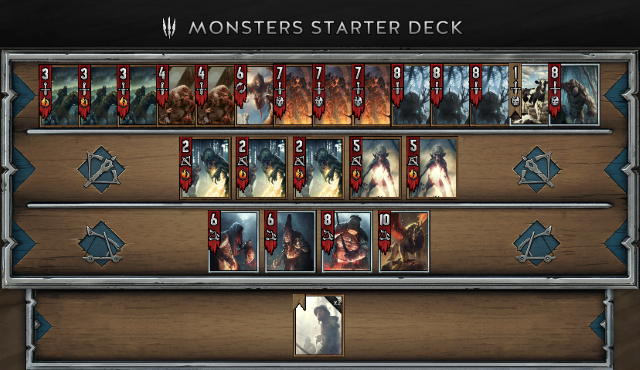
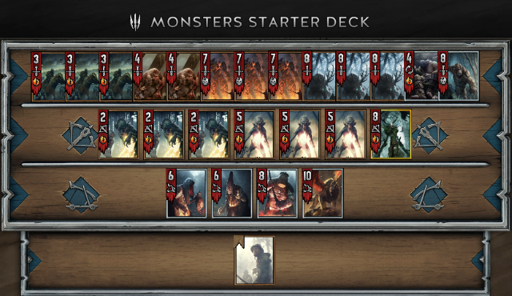

# runGwent
Auto tool for completing daily tasks in Gwent card game. 5 days demo available.

Warning
-------------------
Not working with current version of Gwent game (open beta). May be it will be available later.

Description
-------------------

runGwent helps to complete daily tasks in Gwent card game. It based on image detection and simple OCR. 

You can select hero and cards which will be played, according to the priority you set. Knowing which card will be or may be in your deck, program avoid play cards which demand any descicion.

Program launch Gwent game after you press "Start" button, or after runGwent will be launched (if "Auto play on stratup" checkbox is checked). So you need set path to Gwent.exe before.

There are need 5-6 hours for get 400+ ore. Average winrate 40-60%.

Game Settings
-------------------
 - English language
 - 1366х768 screen resolution
 - Full screen mode
 - Medium/high graphic
 - 100% scaling in window

Available decks
-------------------

The last played deck will be played. Now available only Eredin deck with all cards which not require make any descicions.

Mulligun - now only for Foglets, Wild Hunt Riders and Crones. Later it can be setted.

Animated cards not supported, pls, don't use.

Program requirements
-------------------
 - Windows 7/8/10, x86/x64
 - .netFramework 4.5

First steps
-------------------
 1. Download and unzip <a href="https://github.com/PSEITOV/runGwent/blob/master/output.zip">output.zip file</a>.
 2. Run runGwent.exe.
 3. Press "Path" to set path to Gwent.exe.
 4. Press "Deck" to select cards for your deck (check checkbox in the column "Select").
 5. In the same form set prioritet for cards in you deck. runGwent will play cards with smallest order first.
 6. IsTokkens means that this card will be played only if other cards (non tokkens) is out. This increase speed of searching main cards in hand.
 7. You can try different variants of card sets and their order. Also you can save you deck configuration in *.deck file.
 8. After all, press "Start" button, Gwent game will launched automaticaly and program start work.
 9. If you want stop the program, use ALT+TAB to switch to runGwent window and press "Stop" button. You can play Gwent onward, or use ALT+F4 to close the game.
 10. If you need to restart runGwent, you need close Gwent game or game will be closed by program.
 
For beginners
-------------------
1. Get 3 lvl in game, when you will can mill cards.
2. Mill unnecessary cards, you get ~1000 scraps and can craft Crones and useful bronze cards.
3. When you complete one daily tasks you get 9 lvl and enough scraps to craft Old Speartip, Woodland Spirit and Earth elemental.
4. Next you can craft Geralt (nonpremium), Ciri: Dash, Regis.
5. After you can start collect other cards and play game for fun.

Example of your first and next decks:

Full version
-------------------
pseitov@yandex.ru
